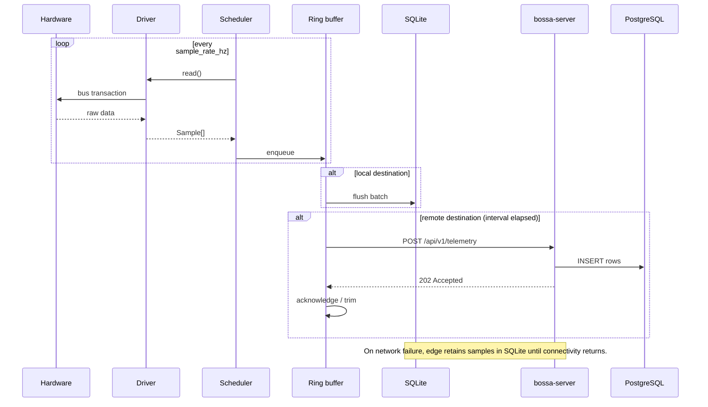

# BOSSA


**Base Operating System for Sensors and Actuators**

BOSSA is a modular C++20 framework for IoT edge devices and an accompanying server
component that publishes telemetry to a SQL database. It targets ARM Linux
(Raspberry Pi 5) and is designed so that new hardware drivers—especially those
already available in C++—can be added with minimal glue code.

The edge runtime samples sensors and actuators on configurable schedules. A
declarative sync policy selects which channels are stored locally, which are
pushed online, and at what frequency. The server component ingests telemetry
from one or many edge nodes and persists it to PostgreSQL.

## Documentation

| Document | Purpose |
|----------|---------|
| [Contributing](CONTRIBUTING.md) | Development constitution: SDD, V-cycle, quality gates, agent policy |
| [Specification](docs/specification.md) | Requirements, APIs, data model, library choices |
| [Roadmap](docs/roadmap.md) | Phased delivery plan and acceptance criteria |
| [Coding guidelines](docs/guidelines.md) | Authoritative C++ and embedded conventions |

## Architecture Overview

BOSSA splits into two deployable binaries that share core libraries:

```
┌─────────────────────────────────────────────────────────────────────────┐
│                           Edge device (Pi 5)                            │
│                                                                         │
│  ┌──────────┐   ┌─────────────┐   ┌──────────────┐   ┌──────────────┐  │
│  │  Config  │──▶│   Driver    │──▶│  Telemetry   │──▶│  Sync engine │  │
│  │  (YAML)  │   │  registry   │   │  scheduler   │   │  + buffer    │  │
│  └──────────┘   └──────┬──────┘   └──────────────┘   └──────┬───────┘  │
│                        │                                      │         │
│               ┌────────┴────────┐                    ┌─────────┴───────┐ │
│               │  bossa::io      │                    │ SQLite (local)  │ │
│               │  GPIO I2C SPI   │                    │ offline cache   │ │
│               └────────┬────────┘                    └─────────┬───────┘ │
│                        │                                      │         │
│               ┌────────┴────────┐                             │ HTTPS    │
│               │ Driver plugins  │                             │ batch    │
│               │ (.so / static)  │                             ▼         │
│               └─────────────────┘                    ┌─────────────────┐  │
│                                                    │ Cloudflare      │  │
│  bossa-daemon (systemd)                            │ Worker + D1     │  │
└────────────────────────────────────────────────────┴────────┬────────┴──┘
                                                              │
                                                     ┌────────▼────────┐
                                                     │  Cloudflare D1  │
                                                     │ (SQLite remote) │
                                                     └─────────────────┘
```

### Edge runtime (`bossa-daemon`)

Long-running systemd service built on `bossa::Service`. Responsibilities:

- Load YAML configuration (devices, channels, sync policies).
- Instantiate drivers through a registry (built-in or dynamically loaded `.so`).
- Run a priority-aware scheduler that calls each driver at its configured
  sample rate without heap allocations in the hot path.
- Buffer samples in a pre-allocated ring buffer and flush to local SQLite when
  the network is unavailable.
- Push batched telemetry to a remote HTTPS endpoint (`server.url`) via
  `POST /api/v1/telemetry`.

### Remote ingress (Cloudflare Worker + D1)

Preferred Phase 4 path: a Cloudflare Worker accepts the same REST contract and
writes to **D1**, reusing the existing Cloudflare SQL stack instead of running a
separate PostgreSQL service. An optional C++ `bossa-server` remains a fallback
only if D1 limits block the deployment.

BOSSA owns the edge-facing upload contract; the Worker maps batches into D1
tables aligned with the companion cloud project.

## Modular Driver Model

Every hardware interface implements `bossa::drivers::Driver`:

```cpp
namespace bossa::drivers {

struct Sample {
  std::string channel_id;
  double value;
  std::chrono::system_clock::time_point timestamp;
  std::string unit;  // physical quantity, e.g. "celsius", not "C"
};

class Driver {
 public:
  virtual ~Driver() = default;
  virtual std::string name() const = 0;
  virtual void configure(const nlohmann::json& parameters) = 0;
  virtual std::vector<Sample> read() = 0;
  virtual void write(const nlohmann::json& command) = 0;
};

}  // namespace bossa::drivers
```

Drivers are registered in one of two ways:

1. **Static** — linked at build time via `BOSSA_REGISTER_DRIVER(MyDriver)`.
2. **Dynamic** — compiled as a shared library (`libbossa_driver_*.so`) and
   loaded with `dlopen` when listed in the configuration file.

Wrapping an existing C++ driver library typically requires only a thin adapter
class that translates its API into `read()` / `write()` and maps its outputs to
`Sample` values.

## Sync Policy

Each channel declares independent sampling and synchronization behavior in
configuration (see [specification](docs/specification.md) for the full schema):

```yaml
channels:
  - id: ambient_temperature
    driver: bme280
    device: /dev/i2c-1
    address: 0x76
    sample_rate_hz: 1.0
    sync:
      destinations: [local, remote]
      remote_interval_seconds: 60
      priority: normal
      mode: batch
```

| Field | Effect |
|-------|--------|
| `sample_rate_hz` | How often the driver is polled on the edge |
| `sync.destinations` | `local` (SQLite), `remote` (server/PostgreSQL) |
| `sync.remote_interval_seconds` | Minimum interval between uploads for this channel |
| `sync.priority` | `critical` / `normal` / `low` — scheduler ordering under load |
| `sync.mode` | `batch`, `realtime`, or `on_change` |

## Technology Stack

| Layer | Choice | Notes |
|-------|--------|-------|
| Language | C++20 | RAII, `std::chrono`, `std::optional`, concepts |
| Build | CMake 3.16+ | Native x86_64 + ARM64 cross-compile |
| Edge GPIO | [libgpiod](https://git.kernel.org/pub/scm/libs/libgpiod/libgpiod.git/) v2 | Character-device API, no sysfs |
| Edge I2C / SPI | Linux `i2c-dev` / `spidev` | Kernel interfaces, zero extra dependencies |
| Configuration | [yaml-cpp](https://github.com/jbeder/yaml-cpp) | Human-readable device and sync config |
| JSON | [nlohmann/json](https://github.com/nlohmann/json) | Driver parameters, API payloads |
| Local storage | [SQLite](https://www.sqlite.org/) | Offline buffer on the edge |
| Remote database | [PostgreSQL](https://www.postgresql.org/) via [libpqxx](https://github.com/jtv/libpqxx) | Primary SQL store; TimescaleDB-compatible |
| HTTP client | [libcurl](https://curl.se/libcurl/) | Edge-to-server telemetry upload |
| HTTP server | [cpp-httplib](https://github.com/yhirose/cpp-httplib) | Header-only REST ingress for `bossa-server` |
| MQTT (optional) | [Eclipse Mosquitto](https://mosquitto.org/) (`libmosquitto`) | Pub/sub bridge for external integrations |
| Plugin loading | POSIX `dlfcn` | Dynamic driver `.so` modules |
| Testing | [Google Test](https://github.com/google/googletest) | Unit and integration tests |
| Logging | `syslog` | Daemon logging per embedded conventions |
| Service manager | systemd | `Type=notify` once readiness signaling is implemented |

## Repository Layout (target)

```
bossa/
├── include/bossa/
│   ├── core/          # Service, scheduler, config loader
│   ├── io/            # GPIO, I2C, SPI abstractions
│   ├── drivers/       # Driver interface and registry
│   ├── telemetry/     # Sample types, ring buffer
│   ├── storage/       # SQLite local store
│   ├── sync/          # Upload scheduler and retry logic
│   └── server/        # REST ingress and DB writer
├── src/               # Implementations
├── drivers/           # Built-in and example driver adapters
├── server/            # bossa-server entry point
├── tests/             # GTest suites (mirrors include/ structure)
├── config/            # Example YAML, systemd units
├── scripts/           # Build, format, deploy
└── docs/              # Specification, roadmap, guidelines
```

## Data Flow



## Current Implementation Status

| Component | Status |
|-----------|--------|
| `bossa::core::Service` daemon base | Implemented (`bossa::core`) |
| `bossa::io` GPIO / I2C abstractions | Implemented (libgpiod + Linux i2c-dev) |
| `bossa::drivers` registry + BME280 | Implemented (mock-tested) |
| `bossa-daemon` edge binary | Implemented (renamed from `bossa`) |
| YAML configuration loader | Implemented (Phase 1 stub) |
| Unit tests (GTest) | Implemented — `./scripts/test/unit.sh` |
| Driver registry | Planned |
| I/O abstractions (GPIO, I2C, SPI) | Planned |
| Telemetry scheduler and buffer | Planned |
| SQLite local store | Planned |
| `bossa-server` REST ingress | Planned |
| PostgreSQL writer (libpqxx) | Planned |
| Dynamic driver plugins | Planned |

See the [roadmap](docs/roadmap.md) for the delivery sequence.

## Quick Start

```bash
./scripts/setup.sh          # install build dependencies
./scripts/build.sh            # native build (x86_64)
./scripts/build.sh -t toolchain-arm64.cmake   # cross-compile for Pi 5
./scripts/sync.sh -t pi@raspberry.local       # deploy to device
```

Full build, test, format, deploy, and contribution workflow are in
[CONTRIBUTING.md](CONTRIBUTING.md).

## License

MIT License. See [LICENSE](LICENSE).
