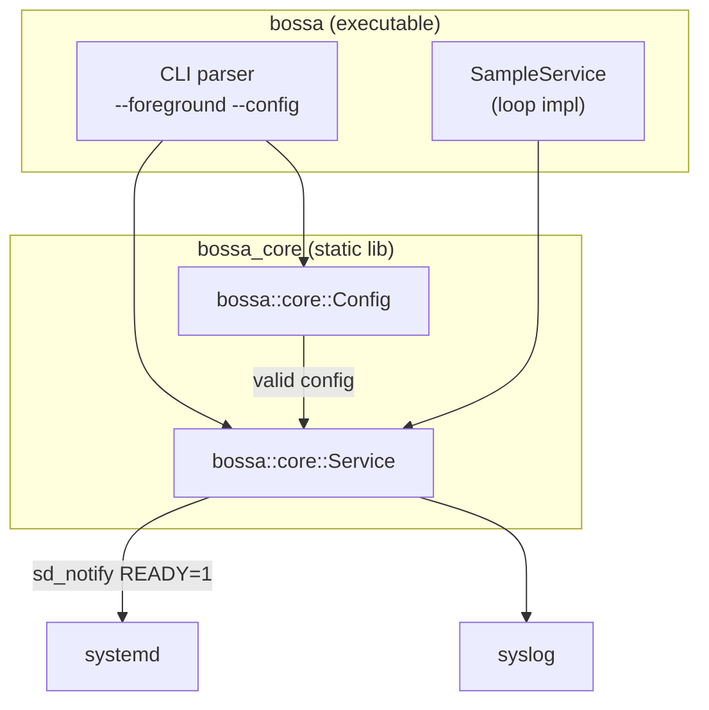

# Phase 1 — Core Runtime

This document describes the **architecture**, **implementation steps**, and **design
patterns** for Phase 1 of the BOSSA roadmap. It is the spec-anchored design
companion to [roadmap.md](roadmap.md) § Phase 1.

**Traceability:** Roadmap Phase 1, items 1.1–1.8.  
**Namespaces:** `bossa::core` (per [specification.md](specification.md) §5).

---

## Goal

Harden the daemon foundation: split the build into libraries, add configuration
loading, establish GTest infrastructure, and make the service testable in
foreground mode.

---

## Architecture

### Module layout (Phase 1 scope)

```
bossa::
└── core::
    ├── Service      Daemon lifecycle, signals, main loop
    └── Config       YAML loader and validation
```

Only `bossa_core` is introduced in Phase 1. Later phases add `bossa_io`,
`bossa_drivers`, `bossa_telemetry`, and so on without changing the core API.

### Build targets

| Target | Type | Contents |
|--------|------|----------|
| `bossa_core` | Static library | `Service`, `Config` |
| `bossa` | Executable | CLI entry point, loads config, runs service loop |
| `bossa_tests` | Test executable | GTest suites for `bossa_core` |

### Component diagram



### Service lifecycle

1. Parse CLI flags (`--foreground`, `--config <path>`).
2. Load and validate YAML config via `Config::load()`.
3. On failure: log `LOG_ERR`, exit with code 1.
4. On success: call `Service::start()`.
5. If not foreground: `fork()`, `setsid()`, redirect stdio, open syslog.
6. Install `sigaction()` handlers for `SIGTERM` and `SIGINT`.
7. Signal readiness with `sd_notify(0, "READY=1")`.
8. Run `loop()` until the `sig_atomic_t` stop flag is set.
9. Log shutdown and return `EXIT_SUCCESS`.

### Config model (stub for Phase 1)

Phase 1 parses the top-level structure only. Full channel and sync parsing
arrives in Phase 3.

```yaml
config_version: 1

node:
  id: greenhouse-sensor-01
  api_key_file: /etc/bossa/api.key

channels: []   # accepted but not yet processed
```

Validation rules:

- `config_version` must be present and equal to `1`.
- `node.id` must be a non-empty string.
- `node.api_key_file` must be a non-empty string.
- Missing file, parse error, or validation failure → `LOG_ERR` + exit 1.

---

## Design patterns

| Pattern | Where | Why |
|---------|-------|-----|
| **Template Method** | `Service::start()` calls virtual `loop()` | Stable daemon shell; subclasses define behavior |
| **RAII** | File handles, syslog scope | No leaked FDs on error paths |
| **Result type** | `ConfigLoadResult` | Explicit success/failure without exceptions on hot paths |
| **Dependency injection** | `ServiceOptions` (foreground flag) | Testable without forking |
| **Fail-fast** | Config load, syscall checks | Invalid state never reaches the main loop |

---

## Implementation steps

| Step | ID | Task | Files |
|------|----|------|-------|
| 1 | 1.1 | Split CMake into `bossa_core` + executable | `CMakeLists.txt` |
| 2 | 1.2 | Add GTest via FetchContent, enable CTest | `CMakeLists.txt`, `tests/` |
| 3 | 1.8 | Add yaml-cpp, GTest, libsystemd to `setup.sh` | `scripts/setup.sh` |
| 4 | 1.5 | Replace `signal()` with `sigaction()` | `src/core/service.cpp` |
| 5 | 1.4 | Add `--foreground` CLI flag | `src/daemon_main.cpp`, `ServiceOptions` |
| 6 | 1.6 | Implement `bossa::core::Config` | `include/bossa/core/config.hpp`, `src/core/config.cpp` |
| 7 | 1.7 | Call `sd_notify(READY=1)` after config load | `src/core/service.cpp`, `config/bossa.service` |
| 8 | 1.3 | Write Service and Config unit tests (≥ 5) | `tests/core/` |
| 9 | — | Example config, update CI workflows | `config/examples/`, `.github/workflows/` |

---

## Defensive programming (Phase 1)

Phase 1 applies the project-wide defensive rules documented in
[CONTRIBUTING.md](../CONTRIBUTING.md#defensive-programming). Highlights for
this phase:

- Every `open()`, `fork()`, `setsid()`, `chdir()`, and `sigaction()` return
  value is checked; failures log `LOG_ERR` and exit.
- Signal handlers set only a `volatile sig_atomic_t` flag — no syslog, no locks.
- Config validation rejects empty strings and unknown `config_version` before
  the service loop starts.
- Foreground mode skips `fork()` so unit tests never daemonize.
- `Service::request_stop()` (test-only) allows clean shutdown without signals.

---

## Acceptance criteria

From [roadmap.md](roadmap.md) Phase 1:

- [ ] `cd build && ctest -V` passes with ≥ 5 Service/Config tests
- [ ] `bossa --foreground` runs without forking; logs to syslog
- [ ] Invalid YAML config → exit code 1 with `LOG_ERR` message
- [ ] Native and ARM64 builds pass in CI
- [ ] `./scripts/clang.sh && git diff --exit-code` clean

---

## Related documents

- [Roadmap — Phase 1](roadmap.md#phase-1--core-runtime)
- [Specification — namespaces](specification.md#5-namespace-and-module-layout)
- [Contributing — defensive programming](../CONTRIBUTING.md#defensive-programming)
- [Coding guidelines](guidelines.md)
