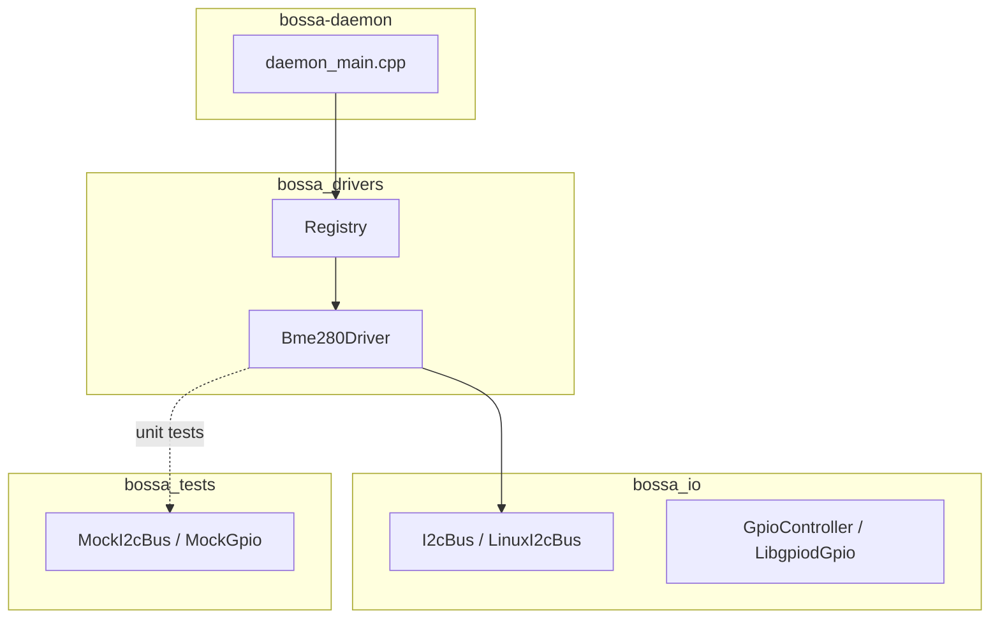

# Phase 2 — I/O Abstractions and First Driver

This document describes the **architecture**, **implementation steps**, and **design
patterns** for Phase 2 of the BOSSA roadmap. It is the spec-anchored design
companion to [roadmap.md](roadmap.md) § Phase 2.

**Traceability:** Roadmap Phase 2, items 2.1–2.9.  
**Namespaces:** `bossa::io`, `bossa::drivers`, `bossa::telemetry` (per
[specification.md](specification.md) §5).

---

## Goal

Introduce virtual hardware I/O interfaces with mocks, a driver framework with
static registration, and a first real sensor driver (BME280) validated by unit
tests. Rename the edge binary to `bossa-daemon`.

---

## Architecture

### Module layout (Phase 2 scope)

```
bossa::
├── io::
│   ├── GpioController      Virtual GPIO line API
│   ├── LibgpiodGpio        libgpiod v2 backend
│   ├── I2cBus              Virtual I2C API
│   └── LinuxI2cBus         Linux i2c-dev backend
├── drivers::
│   ├── Driver              Abstract sensor/actuator interface
│   ├── Registry            Static factory registry
│   └── Bme280Driver        Temperature + humidity over I2C
└── telemetry::
    └── Sample              Reading value + metadata (Phase 3 expands)
```

### Build targets

| Target | Type | Contents |
|--------|------|----------|
| `bossa_io` | Static library | GPIO + I2C backends |
| `bossa_telemetry` | Interface | `Sample`, `SampleQuality` |
| `bossa_drivers` | Static library | Registry + BME280 |
| `bossa-daemon` | Executable | Edge runtime (renamed from `bossa`) |
| `bossa_tests` | Test executable | Core + driver + mock I/O suites |

### Component diagram



### Driver read path (no heap in hot path)

`Driver::read()` returns a fixed-capacity `ReadResult` (`std::array` of
`telemetry::Sample`). Channel identifiers and units are stored in the driver
during `configure()`; `read()` only fills numeric values, timestamps, and
`string_view` references to stable member storage.

---

## Implementation steps

| Step | ID | Task | Files |
|------|----|------|-------|
| 1 | 2.1 | `GpioController` interface | `include/bossa/io/gpio_controller.hpp` |
| 2 | 2.2 | `LibgpiodGpio` backend | `src/io/libgpiod_gpio.cpp` |
| 3 | 2.3 | `I2cBus` + `LinuxI2cBus` | `include/bossa/io/i2c_bus.hpp`, `src/io/linux_i2c_bus.cpp` |
| 4 | 2.4 | Mock I/O | `tests/mocks/` |
| 5 | 2.5 | `Driver` interface | `include/bossa/drivers/driver.hpp` |
| 6 | 2.6 | `Registry` + `BOSSA_REGISTER_DRIVER` | `src/drivers/registry.cpp` |
| 7 | 2.7 | BME280 driver | `drivers/bme280/` |
| 8 | 2.8 | Driver unit tests | `tests/drivers/bme280_driver_test.cpp` |
| 9 | 2.9 | Rename binary to `bossa-daemon` | `CMakeLists.txt`, `config/bossa.service`, CI |

---

## Acceptance criteria

From [roadmap.md](roadmap.md) Phase 2:

- [x] GTest: mock I2C → BME280 driver → expected `Sample` values
- [ ] On Pi 5: `bossa-daemon --foreground` reads real BME280, logs temperature
  every second via syslog (human smoke test)
- [x] No heap allocation in `Driver::read()` (fixed `ReadResult`; audit test)
- [x] libgpiod added to `scripts/setup.sh` and documented in specification

---

## Pi 5 hardware smoke test (manual)

1. Wire BME280 to I2C1 (`/dev/i2c-1`) at address `0x76` or `0x77`.
2. Deploy with `./scripts/sync.sh -t pi@<host>`.
3. Add a channel entry to `/etc/bossa/config.yaml` (scheduler wiring lands in
   Phase 3; for now invoke the driver via a temporary foreground harness or
   extend the daemon loop).
4. Run: `sudo /opt/bossa/bin/bossa-daemon --foreground --config /etc/bossa/config.yaml`
5. Confirm syslog shows temperature readings approximately every second.

---

## Related documents

- [Roadmap — Phase 2](roadmap.md#phase-2--io-abstractions-and-first-driver)
- [Specification — driver interface](specification.md#7-driver-interface)
- [Specification — hardware I/O](specification.md#42-hardware-io-edge)
