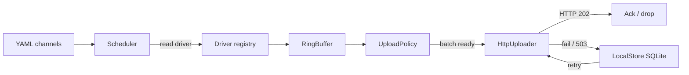

# Phase 3 — Telemetry Pipeline

This document describes the **architecture**, **implementation steps**, and **design
patterns** for Phase 3 of the BOSSA roadmap. It is the spec-anchored design
companion to [roadmap.md](roadmap.md) § Phase 3.

**Traceability:** Roadmap Phase 3, items 3.1–3.9.  
**Namespaces:** `bossa::telemetry`, `bossa::storage`, `bossa::sync` (per
[specification.md](specification.md) §5).

---

## Goal

Add the edge telemetry pipeline: channel/sync config, deadline scheduler, fixed
ring buffer, SQLite offline store, upload policy, and an HTTP uploader that posts
the existing `POST /api/v1/telemetry` contract to a configurable URL.

**Out of scope (this phase):**

- Raspberry Pi / BME280 hardware smoke (Phase 2, paused until hardware access).
- Cloudflare Worker / D1 ingress implementation (Phase 4 lean — see below).
- Non-SQLite remote databases (out of scope).

---

## Platform decision (remote store)

| Layer | Technology | Notes |
|-------|------------|-------|
| Edge offline buffer | **SQLite 3** on the Pi | Required for offline queue; unrelated to cloud choice |
| Remote ingress (Phase 4) | **BOSSA Worker + D1** | Plain SQLite in the cloud; BOSSA-owned Worker + database |
| Edge → remote protocol | `POST /api/v1/telemetry` JSON | Unchanged; `server.url` points at the Worker |

Phase 3 only needs a **configurable upload URL** and a mockable HTTP client.
The Worker/D1 side is Phase 4.

---

## Architecture

```
bossa::
├── core::
│   ├── Config (+ ChannelConfig, ServerConfig, LocalStorageConfig)
│   └── Service (SIGHUP → reload flag)
├── telemetry::
│   ├── Sample / StoredSample
│   ├── RingBuffer
│   └── Scheduler
├── storage::
│   └── LocalStore (SQLite pending_uploads)
└── sync::
    ├── UploadPolicy
    ├── HttpClient / CurlHttpClient
    └── HttpUploader
```

### Data flow



### Hot-path rules

- `RingBuffer::enqueue` / `dequeue`: no heap allocation.
- `StoredSample` owns fixed `char[]` for `channel_id` and `unit` (views from
  `Sample` are copied in).
- Overflow: drop `low` priority first, then oldest; `LOG_WARNING`.

---

## Implementation steps

| Step | ID | Task |
|------|----|------|
| 1 | 3.1 | `StoredSample`, channel/sync enums |
| 2 | 3.2 | `RingBuffer` + overflow tests |
| 3 | 3.3 | `Scheduler` with injectable clock |
| 4 | 3.4 | Full YAML parsing for server / local_storage / channels |
| 5 | 3.5 | `LocalStore` SQLite WAL + `pending_uploads` |
| 6 | 3.6 | `UploadPolicy` (`batch` / `realtime` / `on_change`) |
| 7 | 3.7 | `HttpUploader` + `HttpClient` (libcurl + mock) |
| 8 | 3.8 | Offline queue: fail → SQLite → retry |
| 9 | 3.9 | `SIGHUP` reload of channel rates |

---

## Acceptance criteria

From [roadmap.md](roadmap.md) Phase 3 (software / GTest; no Pi required):

- [x] Config with 3 channels at different rates → scheduler dispatches each at
  the correct frequency (±10 ms tolerance in test with injected clock)
- [x] Ring buffer overflow drops `low` priority first
- [x] Simulated network failure → samples persist in SQLite → succeed on retry
- [x] `SIGHUP` / scheduler reconfigure reloads a changed `sample_rate_hz`
- [x] Native and ARM64 builds pass locally; formatting clean

Coverage target ≥ 90 % on `bossa_telemetry` / `bossa_sync` is aspirational for
this PR; unit tests must cover the acceptance bullets above.

---

## Related documents

- [Roadmap — Phase 3](roadmap.md#phase-3--telemetry-pipeline)
- [Specification — telemetry & sync](specification.md#8-telemetry-types)
- [Phase 2 design](phase-2-io-driver.md) (paused hardware smoke)
