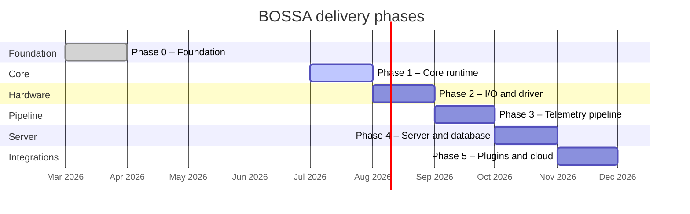

# BOSSA Roadmap

This document defines the phased delivery plan for BOSSA: what we build, in what
order, how we validate each phase, and the acceptance criteria that must pass
before moving on.

Technical details (APIs, libraries, schemas) are in the
[specification](specification.md). Coding conventions are in
[guidelines](guidelines.md).

**Last updated:** July 2026.

---

## Vision

BOSSA becomes the standard edge-and-server stack for IoT deployments in the
Alexandre Loeblein Heinen project ecosystem:

- **Edge:** plug in C++ drivers, declare what to sample and sync, deploy to Pi.
- **Server:** ingest telemetry, write to PostgreSQL, feed the companion cloud
  SQL project.
- **Modular:** new hardware is a driver adapter, not a fork of the framework.

---

## Phase Overview

| Phase | Name | Outcome | Depends on |
|-------|------|---------|------------|
| 0 | Foundation | Daemon skeleton, build, CI | — |
| 1 | Core runtime | Tested Service, config, scheduler | Phase 0 |
| 2 | I/O and first driver | GPIO/I2C abstractions + one real sensor | Phase 1 |
| 3 | Telemetry pipeline | Ring buffer, SQLite, sync policy | Phase 2 |
| 4 | Server and database | REST ingress, PostgreSQL writer | Phase 3 |
| 5 | Plugins and integrations | Dynamic drivers, MQTT bridge, cloud alignment | Phase 4 |



---

## Phase 0 — Foundation ✅ Complete

**Goal:** Repository skeleton with build, cross-compile, deploy, and CI.

### Delivered

- [x] `bossa::Service` daemon base class (fork, setsid, signal handling, syslog)
- [x] Sample `bossa-daemon` with placeholder loop
- [x] CMake native + ARM64 cross-compile (`toolchain-arm64.cmake`)
- [x] Deploy script (`scripts/sync.sh`) and systemd unit (`config/bossa.service`)
- [x] CI: formatting, native build, ARM64 cross-compile
- [x] Coding guidelines, contributing guide, V-cycle policy

### Validation

- [x] `./scripts/build.sh` succeeds on x86_64
- [x] `./scripts/build.sh -t toolchain-arm64.cmake` produces ARM64 binary
- [x] GitHub Actions green on `main`

---

## Phase 1 — Core Runtime

**Goal:** Harden the daemon foundation, add configuration loading, refactor the
build into libraries, and establish the test infrastructure.

### Work items

| ID | Task | How |
|----|------|-----|
| 1.1 | Refactor CMake into `bossa_core` static library | Split `CMakeLists.txt`; separate `bossa-daemon` executable |
| 1.2 | Add GTest infrastructure | `tests/`, `enable_testing()`, CI runs `ctest` |
| 1.3 | Service unit tests | Test signal handler flag, foreground mode, loop invocation count |
| 1.4 | Foreground mode (`--foreground`) | Skip `daemonize()` for local dev and tests |
| 1.5 | Replace `signal()` with `sigaction()` | Per guidelines; test signal delivery |
| 1.6 | YAML config loader (`bossa::core::Config`) | Parse `config_version`, `node`, `channels` stub |
| 1.7 | systemd `Type=notify` readiness | `sd_notify(READY=1)` after config loaded |
| 1.8 | Add dependencies to `scripts/setup.sh` | yaml-cpp, nlohmann/json, GTest |

### Acceptance criteria

- [ ] `cd build && ctest -V` passes with ≥ 5 Service/Config tests
- [ ] `bossa-daemon --foreground` runs without forking; logs to syslog
- [ ] Invalid YAML config → exit code 1 with `LOG_ERR` message
- [ ] Native and ARM64 builds pass in CI
- [ ] `./scripts/clang.sh && git diff --exit-code` clean

### Estimated scope

~15 files changed. No hardware dependency.

---

## Phase 2 — I/O Abstractions and First Driver

**Goal:** Virtual hardware interfaces with mocks, one real sensor driver end-to-end
on the Pi.

### Work items

| ID | Task | How |
|----|------|-----|
| 2.1 | `bossa::io::GpioController` interface | Virtual `read_line()`, `write_line()`, `request_line()` |
| 2.2 | `bossa::io::LibgpiodGpio` implementation | libgpiod v2 character-device backend |
| 2.3 | `bossa::io::I2cBus` interface + Linux backend | `/dev/i2c-*` via `ioctl` |
| 2.4 | Mock I/O for tests | `MockGpio`, `MockI2cBus` in `tests/mocks/` |
| 2.5 | `bossa::drivers::Driver` interface | Per specification §7 |
| 2.6 | `bossa::drivers::Registry` | Static registration macro `BOSSA_REGISTER_DRIVER` |
| 2.7 | First driver: BME280 (or SHT31) | Thin adapter over I2C; temperature + humidity channels |
| 2.8 | Driver unit tests | Mock I2C returns canned register bytes; verify `Sample` values |
| 2.9 | Rename binary to `bossa-daemon` | Update systemd unit, sync script, CI |

### Acceptance criteria

- [ ] GTest: mock I2C → BME280 driver → expected `Sample` values
- [ ] On Pi 5: `bossa-daemon --foreground` reads real BME280, logs temperature
  every second via syslog
- [ ] No heap allocation in `Driver::read()` (verified by test or audit)
- [ ] libgpiod added to `scripts/setup.sh` and documented in specification

### Estimated scope

~25 files. Requires Pi 5 + BME280 for hardware validation.

---

## Phase 3 — Telemetry Pipeline

**Goal:** Scheduler, ring buffer, SQLite local store, and declarative sync policy.

### Work items

| ID | Task | How |
|----|------|-----|
| 3.1 | `bossa::telemetry::Sample` and `Channel` types | Per specification §8 |
| 3.2 | `bossa::telemetry::RingBuffer` | Fixed capacity, no alloc in hot path |
| 3.3 | `bossa::telemetry::Scheduler` | Priority threads, deadline-based polling |
| 3.4 | Full YAML channel + sync config parsing | Per specification §6 |
| 3.5 | `bossa::storage::LocalStore` (SQLite) | `pending_uploads` table; WAL mode |
| 3.6 | `bossa::sync::UploadPolicy` | Evaluate `batch`, `realtime`, `on_change` modes |
| 3.7 | `bossa::sync::HttpUploader` stub | libcurl POST to configurable URL; mock in tests |
| 3.8 | Offline queue | Failed upload → SQLite; retry with backoff |
| 3.9 | Config hot-reload (`SIGHUP`) | Reload channels without process restart |

### Acceptance criteria

- [ ] Config with 3 channels at different rates → scheduler calls each at correct
  frequency (±10 ms tolerance in test)
- [ ] Ring buffer overflow drops `low` priority first
- [ ] Simulated network failure → samples persist in SQLite → succeed on retry
- [ ] `SIGHUP` reloads a changed `sample_rate_hz` without restart
- [ ] ≥ 90 % line coverage on `bossa_telemetry` and `bossa_sync`

### Estimated scope

~30 files. SQLite and libcurl added as dependencies.

---

## Phase 4 — Server and Database

**Goal:** `bossa-server` binary that accepts batched telemetry and writes to
PostgreSQL.

### Work items

| ID | Task | How |
|----|------|-----|
| 4.1 | `bossa-server` binary and CMake target | Separate entry point in `server/` |
| 4.2 | REST API: `POST /api/v1/telemetry` | cpp-httplib; JSON validation |
| 4.3 | Health endpoints | `/api/v1/health`, `/api/v1/health/ready` |
| 4.4 | API key authentication | Bearer token; bcrypt hash in `edge_nodes` table |
| 4.5 | `bossa::server::PgWriter` | libpqxx bulk insert with prepared statements |
| 4.6 | SQL migration scripts | `config/migrations/001_initial.sql` per specification §10.2 |
| 4.7 | Edge upload integration | `HttpUploader` posts real batches to `bossa-server` |
| 4.8 | End-to-end test | Docker Compose: Pi or native edge → server → PostgreSQL |
| 4.9 | TimescaleDB hypertable (optional) | `create_hypertable` migration if extension available |
| 4.10 | systemd unit for `bossa-server` | `config/bossa-server.service` |

### Acceptance criteria

- [ ] Edge node posts batch → row appears in `telemetry_points` table
- [ ] Duplicate batch (replay) → `ON CONFLICT DO NOTHING`; no duplicate rows
- [ ] Invalid API key → 401; edge retains batch
- [ ] Server down → edge buffers in SQLite → uploads on recovery
- [ ] Docker Compose CI job: server + PostgreSQL + curl test passes
- [ ] Native and ARM64 builds pass

### Estimated scope

~25 files. PostgreSQL, libpqxx, cpp-httplib added as dependencies.

---

## Phase 5 — Plugins, MQTT, and Cloud Alignment

**Goal:** Dynamic driver loading, optional MQTT bridge, schema alignment with the
companion cloud SQL project.

### Work items

| ID | Task | How |
|----|------|-----|
| 5.1 | Dynamic driver loading (`dlopen`) | Plugin factory per specification §7.2 |
| 5.2 | Example out-of-tree driver | `drivers/example/` built as `.so` |
| 5.3 | MQTT bridge (optional) | libmosquitto publisher for external subscribers |
| 5.4 | Schema alignment with cloud project | Add columns/tables required by private repo |
| 5.5 | SPI bus abstraction | `bossa::io::SpiBus` for SPI sensors |
| 5.6 | GPIO output driver | Actuator control via `write()` |
| 5.7 | Debian packaging | `.deb` for `bossa-daemon` and `bossa-server` |
| 5.8 | Documentation pass | Update all docs to reflect implemented state |

### Acceptance criteria

- [ ] Load `libbossa_driver_example.so` from config; driver reads mocked hardware
- [ ] MQTT subscriber receives samples published by bridge
- [ ] Cloud project can query `telemetry_points` without schema changes
- [ ] `.deb` installs on Raspberry Pi OS Bookworm; systemd services start
- [ ] Full V-cycle checklist passes (build, test, format, cross-compile, deploy)

### Estimated scope

~20 files. Requires access to companion cloud project schema.

---

## Cross-Cutting Concerns (all phases)

These apply throughout development:

| Concern | Rule |
|---------|------|
| V-cycle | Tests written with architecture, not after |
| Formatting | `./scripts/clang.sh` before every commit |
| Documentation | Doxygen on all public APIs |
| No hot-path alloc | Audit every PR touching scheduler, drivers, buffer |
| Signal safety | `sigaction` + `sig_atomic_t` only |
| CI | All phases must keep GitHub Actions green |
| Cross-compile | ARM64 build verified every phase |

---

## How We Work Each Phase

Every phase follows the same V-cycle loop defined in
[guidelines](guidelines.md) §6:

```
1. Document acceptance criteria (GitHub issue)
        ↓
2. Design interfaces + write functional tests (failing)
        ↓
3. Implement + fine-grained tests
        ↓
4. Run ctest; fix until ≥ 90 % coverage
        ↓
5. Cross-compile → deploy to Pi → smoke test → update docs → PR
```

Each phase ends with a **pull request** referencing the tracking issue. No phase
starts until the previous phase acceptance criteria are met.

---

## Immediate Next Steps (Phase 1 kickoff)

Design and implementation plan: [phase-1-core-runtime.md](phase-1-core-runtime.md).

1. Open GitHub issue: *"Phase 1 — Core runtime: GTest, config loader, foreground mode"*
2. Branch: `cursor/phase-1-core-runtime-e62f`
3. Deliver items 1.1–1.8 from Phase 1
4. PR with acceptance criteria checklist

---

## Risk Register

| Risk | Impact | Mitigation |
|------|--------|------------|
| libgpiod v2 API differences on Pi OS | Driver fails on hardware | Pin libgpiod version in setup.sh; test on Bookworm |
| PostgreSQL not available on edge | Scope creep | SQLite is edge-only; PostgreSQL is server-only |
| Cloud schema changes in private repo | Integration breakage | Define stable `telemetry_points` contract; version API |
| Cross-compile dependency drift | ARM64 build fails | CI cross-compile job on every PR |
| Driver library license conflicts | Cannot ship | Prefer MIT/BSD drivers; isolate GPL in `.so` |

---

## Related Documents

- [Technical Specification](specification.md) — APIs, libraries, schemas
- [Coding Guidelines](guidelines.md) — C++ conventions and V-cycle
- [Contributing](../CONTRIBUTING.md) — Build and PR workflow
- [README](../README.md) — Architecture overview
